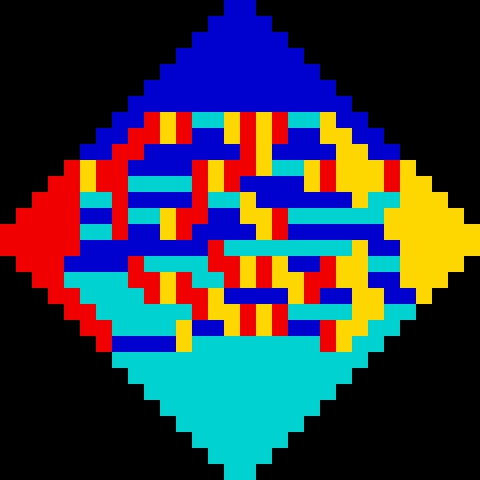
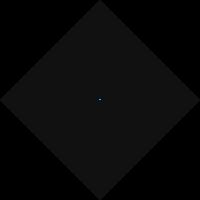
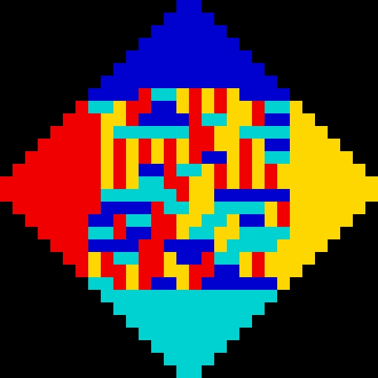
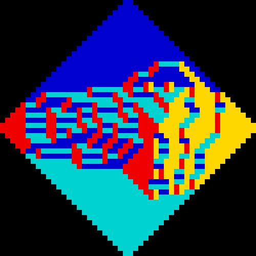
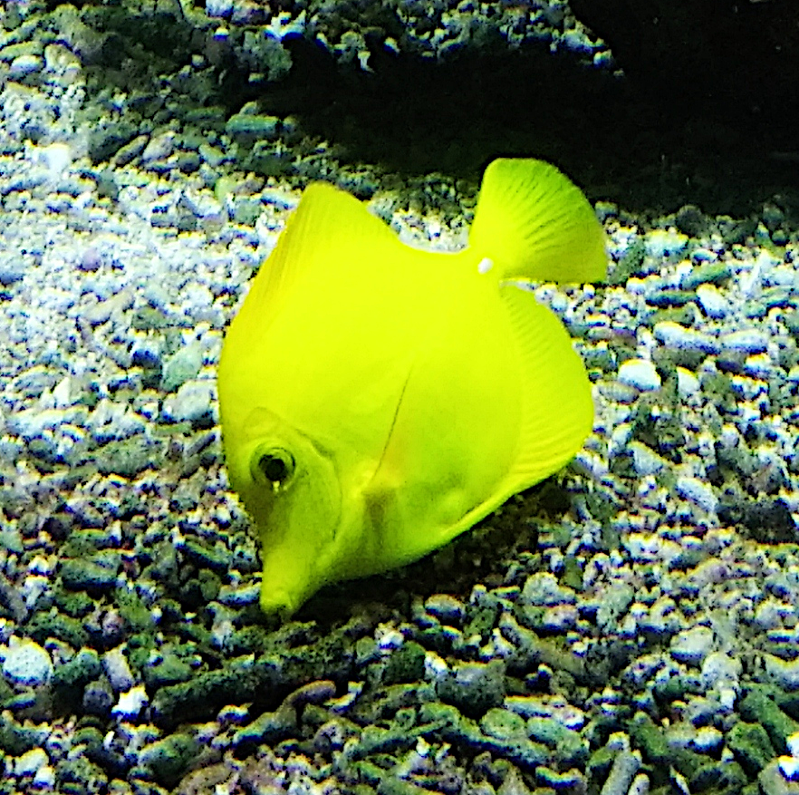
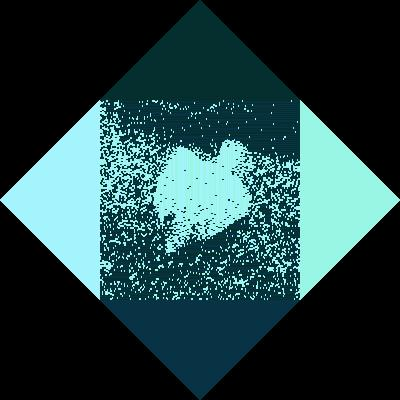
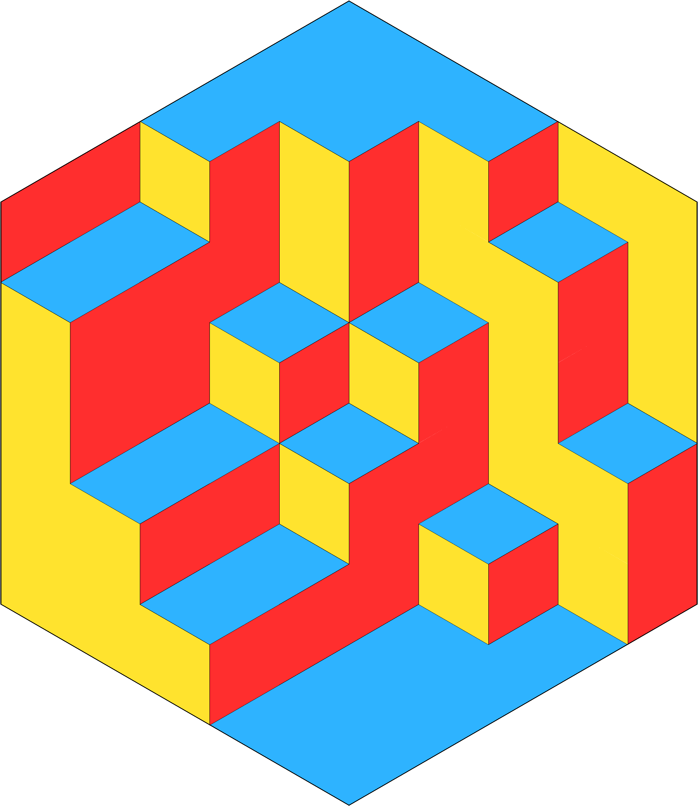
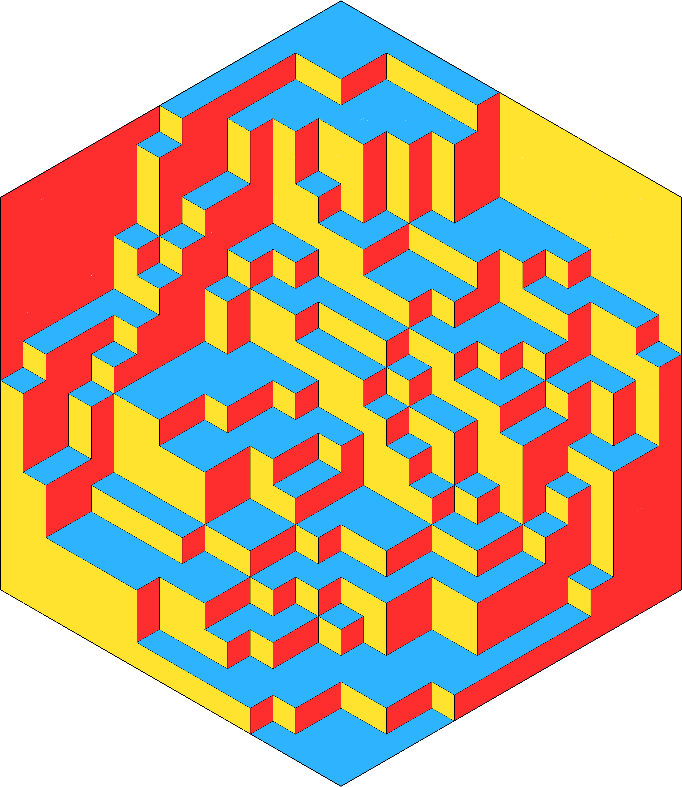
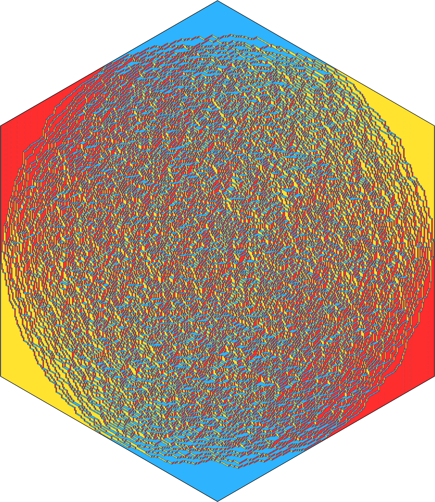

# Génération de pavage aléatoire et calissons

## Le jeu du Calisson
Le jeu du calisson est un jeu inventé par Olivier Longuet où le but est de paver un hexagone avec des losanges [5]. Le but de ce projet est de générer des grilles aléatoirement

## Pavage aléatoire d'un diamant aztèque

Implémentation de l'algorithme décrit dans [1] et [2] pour paver un diamant aztèque par récurrence.

#### Rayon 15


#### Création rayon 100



#### Rayon 2000


### Documentation
`Grid Dominos::get_random_grid(int size)` permet de générer un diamant Aztèque de rayon size aléatoirement.

`img_gen.py sortie.jpeg` permet de transformer la représentation ASCII d'un diamant en image.

`img_gen_creation.py sortie-%d.jpeg` permet de générer les images de l'animation de la création d'un diamant et `gif-maker.py taille entree-%d.jpeg sortie.jpeg` le transforme en gif.

## Pavage aléatoire d'un diamant aztèque avec poids

Implémentation de l'algorithme décrit dans [1], [3], [4] pour paver un diamant aztèque par récurrence avec des arêtes pondérées. Cela permet notamment de paver d'autres graphes comme l'hexagone ([1], [3], [4])

#### Carré de rayon 15


#### Création rayon 100


#### Encodage d'un hexagone rayon 25


#### Utilisation d'une image comme poids



### Documentation
- `Dominos::WeightedGrid` représente un diamant pondéré.
- `void WeightedGrid::set_constant(int val)` met toutes les arêtes à la valeur val.
- `void WeightedGrid::remove_square()` enlève certaines arêtes pour obtenir un carré.
- `void WeightedGrid::remove_hex()` enlève certaines arêtes pour obtenir un hexagone.
- `void WeightedGrid::import_inside_square(std::istream &is)` permet de définir les poids d'un carré à partir d'un flux is.

## Génération de grilles de Calisson complétées

Utilisation des algorithmes précédents pour générer une grille de Calisson aléatoire

### Calisson de rayon 5

### Calisson de rayon 15

### Calisson de rayon 200



### Documentation
- `Calissons::Grid` permet de gérer les grilles de calissons ex :
```c++
Dominos::WeightedGrid wg(Dominos::wg_size_from_hex_size(taille));
wg.set_constant(1);
wg.remove_hex();
Dominos::Grid g = wg.get_random_weighted_grid();
Calissons::Grid c(g);
```
 - `void Calissons::Grid::to_image_blueprint(std::ostream& os)` permet à l'aide de `python calisson_gen.py sortie.jpeg` de générer des images de Calissons.

# Bibliographie

1. Élise Janvresse, & Thierry de la Rue, [Pavages aléatoires par touillage de dominos](https://images.math.cnrs.fr/Pavages-aleatoires-par-touillage-de-dominos/), images.maths.cnrs.fr

1. W. Jockusch, J. Propp et P. Shor. [Random domino tilings and the arctic circle theorem](http://arxiv.org/abs/math.CO/9801068) (1998).

1. J. Propp. [Generalized domino-shuffling](http://dx.doi.org/10.1016/S0304-3975(02)00815-0). Theoretical Computer Science 303 (2003), p. 267-301

1. É. Janvresse, T. de la Rue, Y. Velenik. [A note on domino shuffling](http://www.combinatorics.org/Volume_13/Abstracts/v13i1r30.html). Electron. J. Combin. 13 (2006), no 1.

1. Olivier Longuet, [Le Jeu du calisson](https://www.mathix.org/calisson/blog/), mathix.org